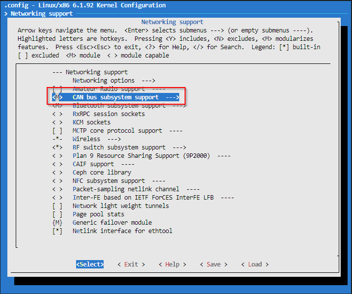

# Using SocketCAN in NI Real-Time Linux

By default, **SocketCAN** is not enabled in NI RT Linux. This guide covers how to enable SocketCAN in the RT kernel and configure PCAN USB for CAN communication.

## 1. Setting Up NI RT Linux
I installed NI RT Linux on an old desktop following [this guide](https://gitlab.tekniker.es/publico/3151-lsst/documentation/maintenancedocuments/ni-linux-rt-installation), but you can also use Windows (cross-compilation required), Linux, PXI, or cRIO.

Once installed:
- Remote into RT Linux using **VS Code + SSH** ([Setup Guide](https://code.visualstudio.com/docs/remote/ssh)).
- Install missing dependencies:
  ```bash
  opkg install git
  ```
- Verify necessary tools:
  ```bash
  make –version
  gcc –version
  bc –version
  flex –version
  bison –version
  depmod –version
  ls /usr/include/openssl/ssl.h
  ls /usr/include/elf.h
  ```
- Check the kernel version:
  ```bash
  cat /etc/os-release
  ```
  Mine was 24.5 kirkstone.

## 2. Building & Configuring the Kernel
Follow NI’s official documentation:
- 📺 [YouTube - Linux Kernel on NI Linux RT](https://www.youtube.com/watch?v=xxxxx)
- 📂 [GitHub - NI Linux Kernel README](https://github.com/ni/nilrt/blob/nilrt/24.5/kirkstone/docs/README.kernel.md)

### Clone the kernel source and configure it:
```bash
git clone -b nilrt/24.5/kirkstone https://github.com/ni/linux.git  
cd linux  
export ARCH=x86_64  
make nati_x86_64_defconfig  
make menuconfig  
```

### Enable **SocketCAN & PCAN USB**:
Follow these steps  
   
   
   
   
   

### Build & Install
Once the configuration is saved, it's time to build the kernel. The process takes around 5 minutes. After building, update the modules.
```bash
make -j$(nproc) bzImage modules
```
Rename bzImage:
```bash
mv /boot/runmode/bzImage /boot/runmode/bzImage-backup
```
Copy the new kernel:
```bash
scp bzImage /boot/runmode/bzImage-6.1.92-rt32
```
Rewrite symlink:
```bash
ln -sf bzImage-6.1.92-rt32 /boot/runmode/bzImage
```
Install the modules and reboot:
```bash
make modules_install
```
If the CAN modules are loaded, verify that the PCAN USB device is detected by running:
```bash
lsmod | grep can && ip link show | grep can
```
## 3. Sending CAN Messages
Set up and send messages over CAN:
```bash
sudo ip link set can0 type can bitrate 500000  
sudo ip link set can0 up  

while true; do  
    cansend can0 123#11223344AABBCCDD  
    sleep 0.1  
done  
```
If a second CAN transceiver is connected, it should receive these messages.

## 4. Calling a Shared Library from LabVIEW
1. Download the precompiled library and source code from [GitHub](https://github.com/titooeee/socketCAN_nilrt). Ensure a PCAN USB device is connected and linked to `can0` at 500 kbps. Copy the shared library to the RT system:/home/lvuser/natinst/bin/libsocketcan_fd.so
2. The repository includes a LabVIEW project. Update the RT IP address and run test.vi to send CAN frames using PCAN USB.

To run C/C++ code or create a shared library for RT Linux, follow this guide:  
📖 [Cross Compiling C/C++ (Developing in Windows PC)](https://nilrt-docs.ni.com/cross_compile/introduction.html)  


